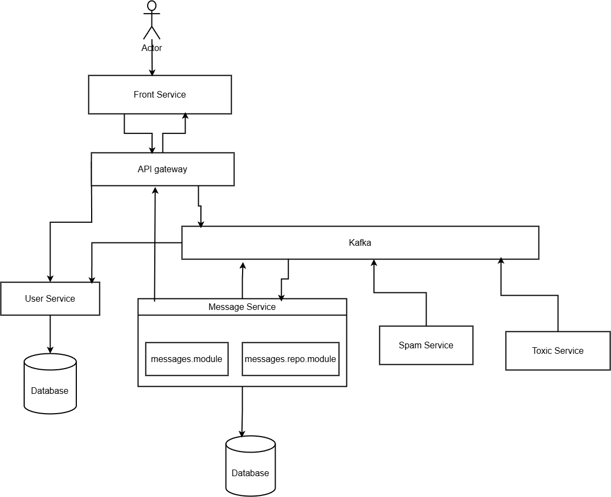

## Microservices for Chat System.

Message service provides functionality for messages in application, this service contains all messages and chat rooms. I use Nest.js for backend, Mongo database and Kafka as message broker.

Full code - [link](https://github.com/vinhngo1907/v-room)

### Whole scheme:

Short description:

- User opens front-end application in web browser and joins chat room, front-end emits an event to the api gateway by socket.io.
- Api gateway gets chat data from the message service by http request and emits this to the front-end.
- For the messaging, front end service communicates with api gateway by socket.io.
- Api gateway implements publish-subscribe pattern to emit raw message events for listeners, through kafka message broker.
- Message service receives raw message events, saves messages and emits events with saved messages.
- Api gateway receives saved messages and emits this to the front-end application.
- Also message service subscribes to analysis events from spam and toxic services, and saves analises for the messages.
